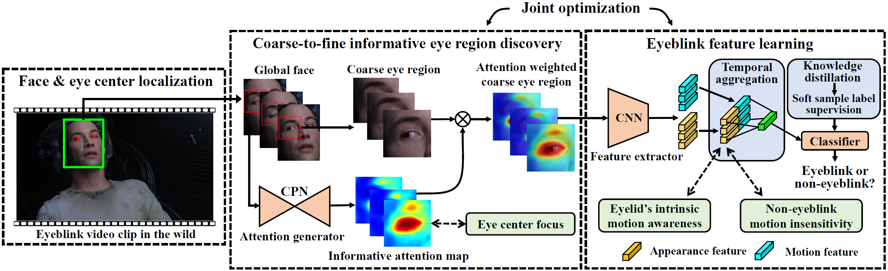

# Eyelid’s Intrinsic Motion-aware Feature Learning for Real-time Eyeblink Detection in the Wild [TIFS 2023]
[Wenzheng Zeng](https://wenzhengzeng.github.io/)<sup>1</sup>, [Yang Xiao](https://scholar.google.com/citations?user=NeKBuXEAAAAJ)<sup>1†</sup>, GuileiHu<sup>1</sup>, [Zhiguo Cao](https://scholar.google.com/citations?user=396o2BAAAAAJ)<sup>1</sup>, Sicheng Wei<sup>1</sup>, [Zhiwen Fang](https://scholar.google.com/citations?user=UX5N_FQAAAAJ)<sup>2</sup>, [Joey Tianyi Zhou](https://joeyzhouty.github.io/)<sup>3</sup>, [Junsong Yuan](https://cse.buffalo.edu/~jsyuan/)<sup>4</sup>

<sup>1</sup>Huazhong University of Science and Technology, <sup>2</sup>Southern Medical University, <sup>3</sup>A*STAR, <sup>4</sup>University at Buffalo

This repository contains the official implementation of the paper "Eyelid’s Intrinsic Motion-aware Feature Learning for Real-time Eyeblink Detection in the Wild", which is accepted by [TIFS](https://ieeexplore.ieee.org/xpl/aboutJournal.jsp?punumber=10206). The manuscript is coming soon!


## Introduction


Real-time eyeblink detection in the wild is a recently emerged challenging task that suffers from dramatic variations in face attribute, pose, illumination, camera view and distance, etc. One key issue is to well characterize eyelid’s intrinsic motion (i.e., approaching and departure between upper and lower eyelid) robustly, under unconstrained conditions. Towards this, a novel eyelid’s intrinsic motion-aware feature learning approach is proposed. Our proposition lies in 3 folds. First, the feature extractor is led to focus on informative eye region adaptively via introducing visual attention in a coarse-to-fine way, to guarantee robustness and fine-grained descriptive ability jointly. Then, 2 constraints are proposed to make feature learning be aware of eyelid’s intrinsic motion. Particularly, one concerns the fact that the inter-frame feature divergence within eyeblink processes should be greater than non-eyeblink ones to better reveal eyelid’s intrinsic motion. The other constraint minimizes the inter-frame feature divergence of non-eyeblink samples, to suppress motion clues due to head or camera movement, illumination change, etc. Meanwhile, concerning the high ambiguity between eyeblink and non-eyeblink samples, soft sample labels are acquired via self-knowledge distillation to conduct feature learning with finer supervision than the hard ones. The experiments verify that, our proposition is significantly superior to the state-of-the-art ones, and with real-time running efficiency. It is also of strong generalization capacity towards constrained conditions.

## Installation

1. Create a new conda environment:

   ```bash
   conda create -n blink_eyelid python=3.8
   conda activate blink_eyelid
   ```
   
2. Install Pytorch (1.7.1 is recommended), opencv-python, tqdm, numpy, scipy.

## Data preparation

Here we provide a pre-processed version of [HUST-LEBW](https://drive.google.com/file/d/1FEesHWfaptJJ39Hf_KyxM6V5cfYoQ-_c/view?usp=sharing), which contains the face images detected by [InsightFace](https://github.com/deepinsight/insightface). Remember to change the dataset root path into yours in `256.192.model/configs.py`.


## Inference

* Run `test.py` for inference and evaluation. Remember to change the dataset path into yours.

  ```bash
  python 256.192.model/test.py
  ```

  **Note:** In the HUST-LEBW benchmark, "left eye" refers to the eye on the left side of the image, rather than the actual left eye. Similarly, "right eye" refers to the eye on the right side of the image, which is mirror-symmetric to our actual eye.

## Citation

Coming Soon.
